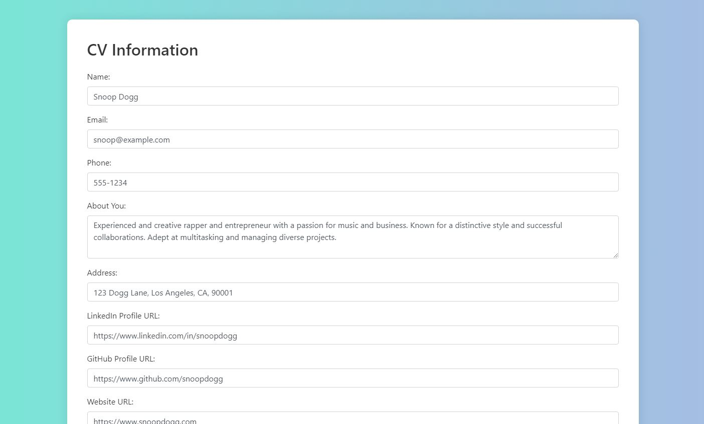
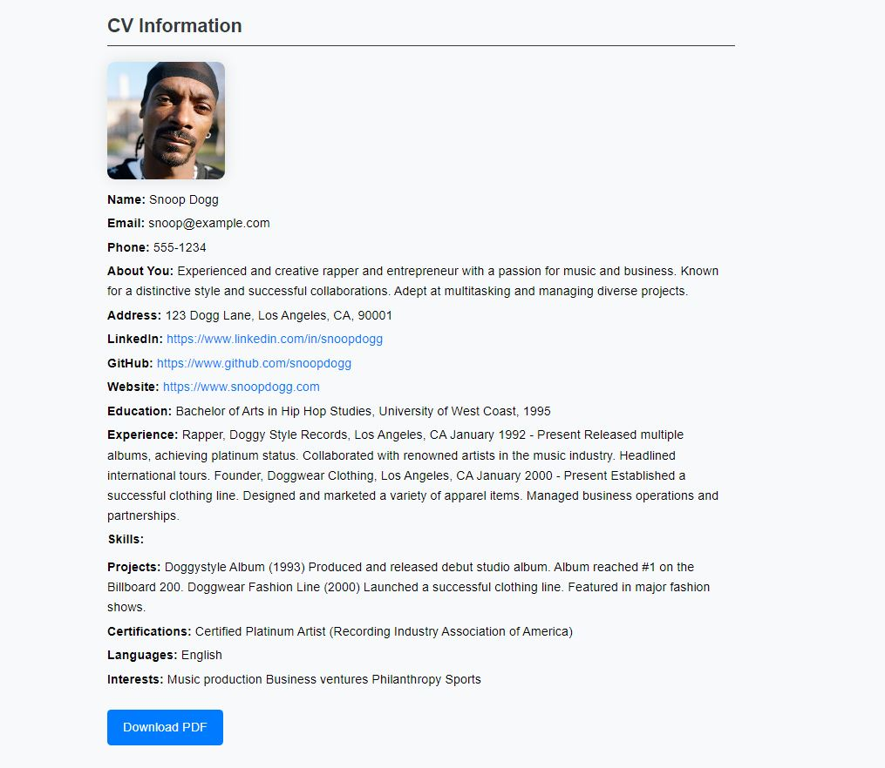

# CV Maker

CV Maker is a dynamic Django web application for creating and managing  resumes. The platform facilitates an intuitive interface for users to input their information, offering the flexibility to generate both HTML and downloadable PDF versions of their resumes. The project also features a centralized list page, providing users with easy access to all created CVs stored in the database.

## Screenshots

### Home Page

### Resume 1

### Resume 2

### CV Database Page

## Key Features

- **User-Friendly Interface**: Experience a seamless and user-friendly interface, enabling users to effortlessly input their information and navigate through the application.

- **Dynamic CV Generation**: Witness the real-time generation of CVs in HTML format, providing users with a live preview of their resumes as they input data.

- **PDF Download**: Enhance your convenience by easily downloading your CV in PDF format with just a single click. Share or print your resume effortlessly.

- **CV List Page**: Streamline the management of all your created CVs through a centralized list page. Access, review, and make edits efficiently.

## What I Learned

Building CV Maker was a transformative journey that allowed me to enhance my skills in Django and web development. Throughout the development process, I gained valuable insights into:

- **Database Management**: I honed my skills in structuring and managing databases efficiently to store and retrieve user-created CVs.

- **Frontend Development**: The project allowed me to strengthen my frontend development skills, creating a visually appealing and intuitive interface for users.

- **PDF Generation**: I learned the intricacies of dynamically generating PDFs from HTML content, providing users with a downloadable and professional-looking resume.

- **Project Organization**: Managing a project of this scale has sharpened my abilities in structuring code, maintaining clean and readable codebases, and ensuring scalability.

